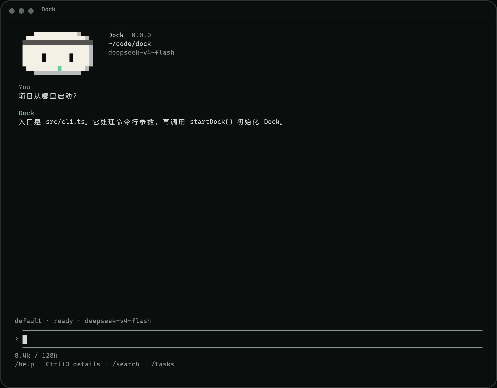

<h1 align="center">Dock</h1>

<p align="center">在终端里理解代码、修改项目并完成任务。</p>

<p align="center">
  <a href="https://github.com/EthDing/dock/releases/latest"></a>
  <a href="https://github.com/EthDing/dock/actions/workflows/ci.yml"></a>
  <a href="LICENSE"></a>
</p>

<p align="center">
  
</p>

Dock 使用 TypeScript 构建，提供模型与工具循环、权限控制、持久会话、context compact、
Auto Memory、通用子 Agent、Agent Skills 和交互式终端界面。

目前支持 Linux 和 WSL2。macOS 尚未完整测试，Windows 原生暂不支持。

## 快速开始

```bash
curl -fsSL https://raw.githubusercontent.com/EthDing/dock/main/install.sh | bash
dock
```

在项目目录中运行 Dock，然后直接描述你想完成的工作。Dock 可以阅读代码、修改文件、
运行命令，并在需要时请求确认。

Bash sandbox 依赖 `bubblewrap`、`socat` 和 `ripgrep`，在 Ubuntu 上装好后运行 `/sandbox`
即可启用。

更多使用说明见 [Dock 用户文档](docs/README.md)。

## 开发

```bash
pnpm install --frozen-lockfile
pnpm run ci
```

使用 `pnpm preview:tui` 可以在不连接模型的情况下预览 TUI。
